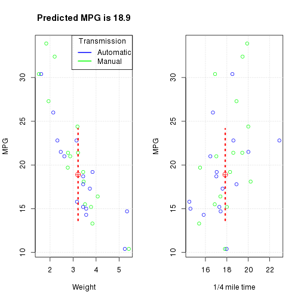

## Slide 2
### Motor Trend Car Road Tests
The data was extracted from the 1974 Motor Trend US magazine, and comprises fuel consumption and 10 aspects of automobile design and performance for 32 automobiles (1973–74 models).
Our goal is to build an application which uses a linear model to predict miles per gallon.
 

---

## Slide 3
### Building a linear model
We build a linear model as follows:

```r
lm1 <- lm(mpg ~ . - 1, data = mtcars)
```

We use AIC-based stepwise algorithm to decrease the number of predictive variables in the model to reduce complexity.

```r
lmAIC <- step(lm1)
```

The final model with the AIC score of 61.31 is next:

```r
lm2 <- lm(mpg ~ wt + qsec + am - 1, data = mtcars)
```

---
## Slide 4
### Shiny application for prediction miles per gallon
A shiny application consists of two parts: a user interface and a server side. A user interface of a shiny app allows us to input a weight, 1/4 mile time and choose a type of a transmission. A server side builds a linear model based on input values. This results in reactive displaying of two plots which show a predicted MPD with confidence interval.

---

## Slide 5
### Resulting Plot with Predicted MPD

 

